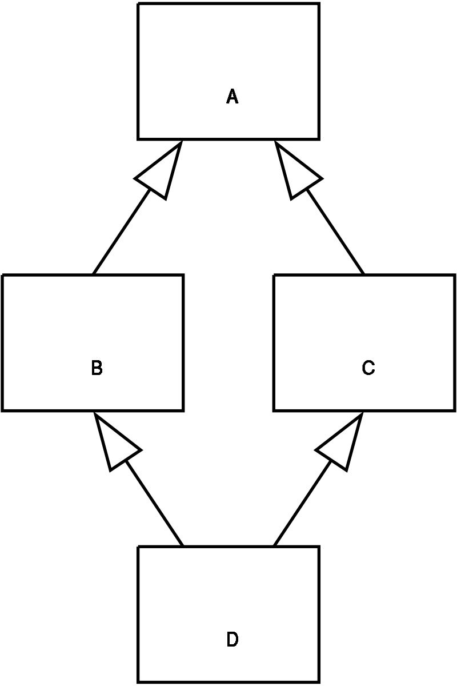

--- 
title: Java - Interfaces
author: Tomasz Kapela
theme: Copenhagen
date: November 17, 2022
---

[//]: # (
Interfaces
Polymorphism
Final, sealed method and classes
Exceptions, Files
)

# Interfaces

> An **interface** in the Java programming language is an abstract type 
> that is used to specify a behaviour that classes must implement. 

>  Interface is a contract between programmers: 
>  creators of the software (class, library) and users. 
>
>  Users do not need to know implementation details to use software.
>  
>  Creators are free to change internal software details as long as 
>  they do not change its interface.
 
> **API (Application Programming Interface)** 
> 
> Typically, in commercial software products API is made public 
> but implementation details are kept secret.  

# Interfaces in JAVA

Interface in JAVA is a reference type, similar to abstract class
that contains only

* public methods signatures, 
* static constants,
* static methods (Java 8),
* default methods (Java 8),
* nested types,
* private methods (Java 9).

# Interface definition

```java
public interface Shape{
    double getArea();
    double getPerimeter();
}
```

* Methods signatures have no implementation and end with semicolon ;.
* Methods are implicitly public and abstract (we can omit specifiers)

Interfaces cannot be instantiated (just like the abstract class)

```java 
Shape shape = new Shape(); // ERROR!
```


# Interface implementation 

We implement interface using `implements` keyword.

We have to override all abstract methods for the interface 
or mark class with `abstract` keyword.  

```java
public interface Shape{
    double getArea();
    double getPerimeter();
}

public class Circle implements Shape {
    private double r;

    public Circle(double r){
        this.r = r;
    }
    public double getArea(){
        return Math.PI * r * r;
    }
    public double getPerimeter(){
        return 2 * Math.PI * r;
    }
}
```

# Interfaces as references

Interfaces are reference types 
and can be used to refer to classes that implement given interface.

```java 
Shape shape = new Circle(5);
```

We can store objects of types that implement given interface in one array.

```java 
Shape[] shapes = { shape, new Circle(5), new Rectangle(3,4) };
```

It helps also to write abstract algorithms 

```java 
static void printInfo(Shape shape){      
   System.out.println("Area : " + shape.getArea() 
               + " Perimeter : " + shape.getPerimeter());
} 
```

# Implementation of multiple interfaces

```java
public interface Drawable {
void draw();
}
```

```java
public class Circle implements Shape, Drawable {
  private double r;

    public Circle(double r){
        this.r = r;
    }
    public double getArea(){return Math.PI * r * r;}
    public double getPerimeter(){return 2 * Math.PI * r;}
    public void draw() {
      // implementation
    }
}
```

# Default implementation of method

If we add new method signature to the interface it will break the legacy code.

```java
public interface Shape{
    double getArea();
    double getPerimeter();
    String getName ();
}
```

Since Java 8 interfaces can contain a default implementation of the method.

We mark such methods with `default` keyword and call them **default methods**.

```java
public interface Shape{
    double getArea();
    double getPerimeter();
    default String getName () {
        return "?";
    }
}
```

When class implements interface `Shape`
*  it can still implement `getName` method (overriding it),
*  if it does not override, then the default method will be used.

[Przykład: TimeClient](https://dev.java/learn/implementing-an-interface/#anchor_4)

# Calling default method

```java
public interface Drawable {
  void draw(){
     /// default implementation
  }
}
```

```java 
public class Circle implements Shape, Drawable {
    private double r;
    public Circle(double r){this.r = r;}
    public double getArea(){return Math.PI * r * r;}
    public double getPerimeter(){return 2 * Math.PI * r;}
    public void draw() {
        Drawable.super.draw();
        // additional code
    }
}
```

The class `Circle` implements the interface `Drawable` and overrides `draw` method. 
We can call default `draw` method using syntax `Drawable.super.draw()`.


# Interface and abstract class

*  A java class can implement multiple interfaces but extend only one abstract class.
*  Implementation: Abstract class can provide the implementation of the interface. Interface can’t provide the implementation of an abstract class.
*  Multiple implementations: An interface can extend another Java interface only, an abstract class can extend another Java class and implement multiple Java interfaces.
*  Accessibility of Data Members: Members of a Java interface are public by default. A Java abstract class can have class members like private, protected, etc.

Source: [https://www.geeksforgeeks.org/difference-between-abstract-class-and-interface-in-java/](https://www.geeksforgeeks.org/difference-between-abstract-class-and-interface-in-java/)

# Final fields and methods

```java
public class MyClass {
    static final int staticValue = 5;

    final int finalValue;
    //  final int finalValue = 1;         // ERROR: Two initializations
    
    final int finalWithDefaultValue = 2;
    
    //  final int finalValueUnitialized;  // ERROR: Unitialized
    
    MyClass(int value){
        this.finalValue = value;
    }

    final void printValue(){
        System.out.println(finalValue);
    }
}
```

* Final fields can be set only once. 
* Final method cannot be overridden.

# Final fields cannot be changed

Final fields can be set only once. 
After uncommenting any of the commented lines the code will not compile.

```java
public class MainFinal {
  public static void main(String[] args) {
    //        MyClass.staticValue = 10;
    System.out.println(MyClass.myValue);
    MyClass myClass = new MyClass(1);
    //        myClass.finalValue = 2;
    System.out.println(myClass.myValue3);
  }
}
```


# Final methods cannot be overridden

```java
public class MyClassChild extends MyClass {

    MyClassChild(){ super(10); }

//    void printValue(){
//        System.out.println("Value3 will be printed");
//        System.out.println(myValue3);
//    }
}
```

Final methods cannot be overridden. 
After uncommenting the commented lines the code will not compile.

# Fields in interfaces

```java
public interface MyInterface {
double pi = 3.14;
// It's the same as: final static double pi = 3.14;
}
```

Interfaces can contain only final static fields.  
If we do not have to provide those modifiers, they are implicit.  
The field will be treated as if they are present.


# Interface inheritance

```java
public interface MyInterface {
  double pi = 3.14;
}

public interface MyChildInterface extends MyInterface {
  double e = 2.78;
}
```

An interface can extend another interface (or several interfaces separated by commas).


# Interface multiple inheritance

```java 
public interface Clonable {
    Clonable clone();
}

public interface Comparable {
    boolean lessThen(Comparable other);
}

public interface ClonableAndComparable extends Clonable, Comparable{
    static Clonable cloneSmaller(ClonableAndComparable a, ClonableAndComparable b){
        if(a.lessThen(b)) {
            return a.makeCopy();
        } else {
            return b.makeCopy();
        }
    }
}
```

# Example Exam Question

(Multiple choice)

A,B are classes, C,D are interfaces. Proper definition of E can start with the following:

1)  class E extends A, B
2)  class E extends A implements C
3)  class E implements C, D
4)  interface E extends A
5) interface E extends C, D


# Diamond problem




```java 

interface A{
    default void print() { System.out.println("A"); }
}
interface B extends  A{
   double x = 1;
   default void print() { System.out.println("B"); }
}
interface C extends A{
    int x = 2;
    default void print() { System.out.println("C"); }
}
public class Diamond implements B, C{
    @Override
    public void print() {
        System.out.println("D");
        //   B.super.print();

        System.out.println(B.x);
//        System.out.println(x);
    }

    public static void main(String[] args) {
        C d = new Diamond();
        d.print();
    }
}
```
If A, B, C are interfaces, 
B,C can each provide a default implementation to an abstract method of A, 
causing the diamond problem. 
Class D must reimplement the method 
(the body of which can simply call one of the parent implementations), 
or we will get a compile error.


# Summary on Interfaces 

* We can’t create an instance(interface can’t be instantiated) of the interface but we can make the reference of it that refers to the Object of its implementing class.
* A class can implement more than one interface.
* An interface can extend to another interface or interfaces (more than one interface).
* A class that implements the interface must implement all the methods in the interface.
* All the methods are public and abstract. And all the fields are public, static, and final.
* It is used to achieve multiple inheritances.

# Exceptions

What will happen when we try to compile and execute this program?
```java
package pl.edu.wsb_nlu.java.lecture4.exceptions;

public class Experiment {
  public static void main(String[] args) {
    String a = null;
    System.out.println(a.toLowerCase());
  }
}
```

The code will compile but during runtime we get the following:

```java
Exception in thread "main" java.lang.NullPointerException
at pl.edu.wsb_nlu.java.lecture4.exceptions.Experiment.main(Experiment.java:6)
```

An exception is thrown.

# Exceptions

An **exception** (or exceptional event) is a problem that 
arises during the execution of a program, such that 
the normal flow of the program is disrupted.

In Java, exceptions are objects of child classes of the `Exception` class.
They can be used with throw clause.
    
The exception can be caught in try-catch clause. 
If we do not catch them, 
the execution of program will be terminated and we get then stack trace printed.


# Try-catch clause


```java
try {
    // Here should be code where an exception can be thrown
} catch (ExceptionClass e) {
    // This will be run after throwing an exception
} finally {
    // This will be run at the end of try-catch clause, 
    no matter whether the exception has been thrown, catched or neither of them
}
```


```java
public class Experiment2 {
  public static void main(String[] args) {
    String a = null;
    try {
      System.out.println(a.toLowerCase());
    } catch (NullPointerException e) {
      System.out.println("String is null!");
    }
  }
}
```

What will happen when we try to compile and execute this program?


# Try-catch example
```java
public class Experiment3 {
  public static void main(String[] args) {
    String a = null;
    try {
      System.out.println(a.toLowerCase());
      System.out.print("1");
    } catch (ArithmeticException e) { // It is not NullPointerException!
        System.out.print("2");
    } finally {
        System.out.print("3");
    }
    System.out.print("4");
  }
}
```

What will be written to the standard output by this program?


# Multiple catch blocks

We can catch different exceptions based on its class and perform different actions then.

```java
public class MultipleCatch {
  public static void main(String[] args) {
    String a = null;
    try {
      System.out.println(a.toLowerCase());
      System.out.print("1");
    } catch (ArithmeticException e) {
      System.out.print("2");
    } catch (NullPointerException e) {
      System.out.print("3");
    } finally {
      System.out.print("4");
    }
    System.out.print("5");
  }
}
```


# Multiple exceptions in one catch block

We can catch different exception instances in one catch block.

```java
public class MultipleCatch2 {
  public static void main(String[] args) {
    String a = null;
    try {
      System.out.println(a.toLowerCase());
      System.out.println("1");
    }catch(ArithmeticException|NullPointerException e) {
      System.out.println("2");
    }
    System.out.print("4");
  }
}
```

# Multiple exceptions in one catch block

We can use parent class (RuntimeException 
is parent class of both ArithmeticException and NullPointerException).


```java
public class CatchParent {
  public static void main(String[] args) {
    String a = null;
    try {
      System.out.println(a.toLowerCase());
      System.out.println("String1");
    } catch (RuntimeException e) {
    //        } catch (RuntimeException | NullPointerException e) {
      // Line above will not compile because RuntimeException is parentClass of NullPointerException
      System.out.println("String2");
    }
    System.out.println("String4");
  }
}
```

# Exception hierarchy


Types of exceptions:

* **Errors** - (subclasses of Error) usually exceptional conditions that are external to the application 
        like hardware or system failure. 
        The application usually cannot recover from it. 
     Still printing backtrace can be helpful.
* **Runtime Exeptions** - (subclasses of RuntimeException) internal problems of the application
  that usually we cannot recover from (like bugs in the code, logical errors) e.g. NullPointerException.
* **Checked exceptions** - (Other Exceptions) - are subject to the Catch or Specify Requirement : 
  they need to be caught in given function or function has to be marked as potentially throwing. 

# Reading a file 

We can use `Scanner` class to read a file.

```java
// imports

public class FileReadingScanner {
  public static void main(String[] args) {
    try {
        Scanner scanner = new Scanner(new File("file.txt"));
        while (scanner.hasNext())
          System.out.println(scanner.nextLine());
    } catch (IOException e) {
        System.out.println("File not found!");
    }
  }
}
```

IOException is checked exception - 
if we simply put a 'new Scanner(fileobject)' without try-catch clause, 
the program will not compile.


# Reading a file

There is an alternative to add 'throws' 
keyword with exception class to the method's signature. 
Then we delegate the exception handling to the upper method. 


```java
// imports

public class FileReadingScannerThrows {

   public static void readFile(String name) throws IOException {
      Scanner scanner = new Scanner(new File(name));
      while (scanner.hasNext())
         System.out.println(scanner.nextLine());
   }

   public static void main(String[] args){
      try{
        readFile(args[0]);
      } catch(IOException e) {
         System.out.println("Cannot read file!");
      }
   }
}
```

If we use it in the main method, the try-catch clause will not be needed 
(what is not recommended to do).

```java
// imports

public class FileReadingScannerThrows {
  public static void main(String[] args) throws IOException {
     Scanner scanner = new Scanner(new File("file.txt"));
     while (scanner.hasNext())
        System.out.println(scanner.nextLine());
  }
}
```

# Reading a file

Here is shown an alternative way of reading files using java NIO package.

```java
// imports

public class FileReadingNIO {
  public static void main(String[] args) {
    Path path = Paths.get("file.txt");
    try {
      List<String> stringList = Files.readAllLines(path);
      for (String s: stringList)
        System.out.println(s);
    } catch (IOException e) {
      System.out.println("File not found!");
    }
  }
}
```

# Throwing an exception

```java
public class Throwing {

    public static void throwException(){
        try {
            throw new Exception("This is message");
        } catch (Exception e) {
            System.out.println(e.getMessage());
        }
    }

    public static void main(String[] args) {
        throwException();
    }
}
```

# Throwing an exception

```java
public class Throwing2 {

    public static void throwException() throws Exception{
        throw new Exception("This is message");
    }

    public static void main(String[] args) {
        try {
            throwException();
        } catch (Exception e) {
            System.out.println(e.getMessage());
        }
    }
}
```
We can delegate the exception handling to upper method.


# Throwing an exception

```java
public class Throwing3 {

    public static void throwException() throws Exception {
        throw new Exception("This is message");
    }

    public static void main(String[] args) throws Exception{
        throwException();
    }
}
```
This is not recommended, but it compiles.

# Writing to file

```java
package pl.edu.wsb_nlu.java.lecture4.files;

import java.io.BufferedWriter;
import java.io.FileWriter;
import java.io.IOException;

public class FileWritingBufferedWriter {
  public static void main(String[] args) throws IOException {
    BufferedWriter writer = new BufferedWriter(new FileWriter("file2.txt"));
    writer.write("My message");
    writer.close();
  }
}
```

# An alternative way of writing to file

```java
package pl.edu.wsb_nlu.java.lecture4.files;

import java.io.IOException;
import java.nio.file.Files;
import java.nio.file.Path;
import java.nio.file.Paths;

public class FileWritingNIO {
  public static void main(String[] args) throws IOException {
      Path path = Paths.get("file3.txt");
      Files.write(path, "I love Java!".getBytes());
  }
}
```


# References

* [https://dev.java/learn/interfaces/](https://dev.java/learn/interfaces/)